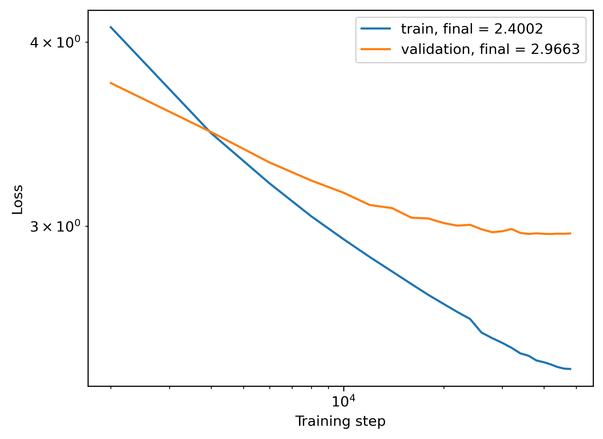

# myGPT2

GPT‑2–style language model with a streaming FineWeb‑Edu dataloader, optional custom tokenizer, and DDP‑ready training loop. We recently trained a 124M model on ~35BT of FineWeb-Edu data, with performance reaching that of GPT-3's 124M model.

## Project layout
- `model.py` — GPT backbone and generation helpers.
- `train_utils.py` — optimizer, LR schedulers (cosine or plateau), training loop, checkpointing, plotting.
- `data_utils.py` — tokenization helpers plus streaming HF dataset → fixed‑length block loaders.
- `config.py` — hyperparameters/presets (default is tiny; switch to `Config()` for a GPT‑2–like run).
- `train_tokenizer.py` — trains a regex BPE tokenizer on a slice of FineWeb‑Edu, writes `tokenizer.json`.
- `run_train.py` — training entrypoint; supports single device or DDP via `torchrun`.
- `run_pretrained.py` — load `checkpoint.pt` and generate text.

## Setup
```bash
pip install torch datasets tiktoken numpy matplotlib
```
You need network access to stream `HuggingFaceFW/fineweb-edu` (config `sample-100BT`).

## Configuration
- Edit `config.py`; flip `cfg = Config().tiny()` to `cfg = Config()` for a GPT‑2–style model (768‑d, 12 layers, 1024 ctx, vocab 50k).
- Key knobs: `batch_size`, `macro_batch_size` (gradient accumulation target), `max_steps`, `eval_interval`, `lr` / `min_lr`, `scheduler` (`cosine` or `plateau`), `grad_clipping`.
- Tokenizer: set `use_tiktoken = True` to use GPT‑2 BPE; set to `False` to load `tokenizer.json` from the custom regex tokenizer (must include `<|endoftext|>` as a single token).

## Data pipeline (data_utils.py)
- Source: streaming FineWeb‑Edu train split (`HuggingFaceFW/fineweb-edu`, `sample-10BT`).
- `HFDocStream`: IterableDataset that shards by `world_size * num_workers`, shuffles with an epoch‑dependent seed, and supports an optional `limit` (used to shrink load on non‑CUDA).
- `BlockStream`: wraps a doc stream, tokenizes each doc, appends `<|endoftext|>`, concatenates, and emits fixed `(x, y)` blocks of length `T` (pads final tail). Validation can be materialized in memory on rank 0.
- `Build_datasets`: train is streaming; val caches a fixed doc slice on rank 0 then broadcasts and shards it so all ranks get the same-sized slice.
- `Construct_data_loaders`: builds block loaders (batch_size = blocks). No sampler/shuffle at DataLoader level; per‑epoch shuffling is driven by `set_epoch` on the doc stream.

## Recent run
- Trained on ~35BT of FineWeb‑Edu (sample‑100BT); final validation loss: 2.935.
- For refernece, OpenAI's open-weight GPT-2 124M model have a validation loss of 3.282.
- Loss curve: 
- After some investigation, the periodic ripples in the training loss is related to the document structure within each .parquet file of FineWeb-Edu. 
- As I am streaming the data, it is challenaging to perform a global shuffle of the docs. But As I increase the shuffle buffer, the ripples are damped. The ripples do not seem to affect validation performance or eval score on HellaSwag


## Training
Single device:
```bash
python run_train.py
```
DDP (example 8 GPUs):
```bash
torchrun --nproc_per_node=8 run_train.py
```
Notes:
- Grad accumulation: `macro_batch_size // batch_size`; must be divisible by world size.
- Mixed precision on CUDA (bfloat16) or MPS (float16). TF32 enabled on CUDA.
- Cosine decay by default; plateau scheduler uses a recent‑window minimum to avoid stopping on spikes.
- Validation runs on all ranks; losses are averaged across ranks.
- Checkpoint saved to `checkpoint.pt`; loss curve to `loss_plot.png`.

Resume:
```bash
python run_train.py --resume
```

## Tokenizer (optional)
Train the regex BPE tokenizer on a small FineWeb‑Edu slice:
```bash
python train_tokenizer.py
```
Then set `use_tiktoken = False` in `config.py` to use `tokenizer.json`.

## Sampling
```bash
python run_pretrained.py
```
Enter a prompt; output is written to `generated.txt`.
To sample with OpenAI's GPT-2 124M weights, uncomment the line `model = GPTLanguageModel.load_gpt2_from_hf().to(config.device)`
